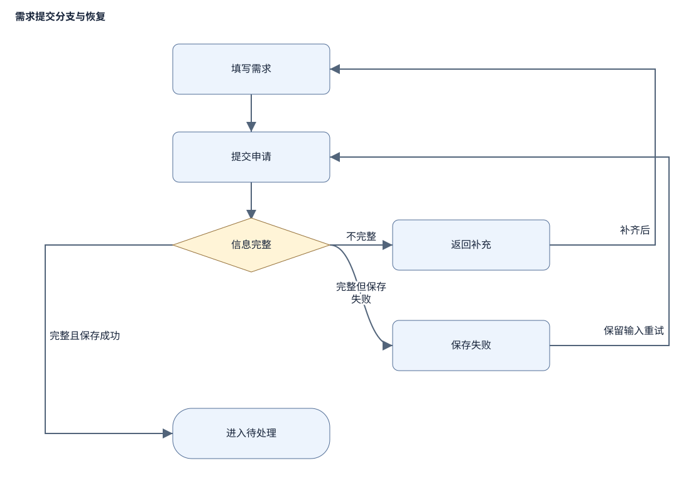

> 虚构样例：用于展示中文写作与文图布局。需求未经真实用户验证，demo 的评审回执为 mock。

# 内部需求提交 PRD（虚构示例）

## 概述
员工在内部需求页面填写标题和描述并提交申请，减少群聊中重复补问。当前需求来自 brief 与 PM 访谈，尚未开展真实用户观察。

## 目标与范围
员工完成一次提交后能确认需求已收到，失败时知道如何继续。暂无量化基线，先观察提交任务完成情况。
本期只支持员工提交需求，不包含自动审批。

## 主流程
填写需求 → 提交申请 → 判断信息完整。信息完整时进入待处理，信息不完整时返回补充。保存失败保留输入，允许重试。

## 需求与验收
FR-01：只有登录员工可以提交。员工填写标题和描述后点击“提交申请”，信息完整时进入待处理并显示已收到；信息不完整时返回补充。
信息完整指标题和描述去除首尾空白后均非空。
验收：已登录员工填写完整信息并提交后，看到已收到及待处理状态；缺少标题、缺少描述或只填写空格时仍留在填写页，提示补充，原输入保留。QA 通过页面操作验证这些分支。
FR-02：保存失败保留输入，允许重试；重复点击不得产生两份记录。
验收：保存失败时输入仍可见，点击重试成功后仅有一份需求；QA 模拟失败与重复提交检查记录数。
另外模拟服务端已保存但成功响应丢失：员工重试后最终仅有一份需求，页面显示已收到。

## 权限、依赖与风险
未登录用户先登录再提交。现有登录和记录保存能力由内部平台提供；若接口行为与本文冲突，产品负责人和平台负责人先确定行为后实现。
产品负责人验证范围；QA 验证每条需求。权限或数据丢失问题不得按默认行为绕过。
本文决定范围及行为，既有接口文档决定数据协议；两者冲突时停止相关实现，由产品负责人和平台负责人共同确定行为后继续。不得修改既有登录机制，它由平台维护。
主要风险：保存失败恢复未按定义处理，会让员工丢失已填内容。验证方式：模拟保存失败后完成重试。

## 来源
需求提交改进 brief v1；PM 访谈第 1 轮。均为虚构演示材料。
